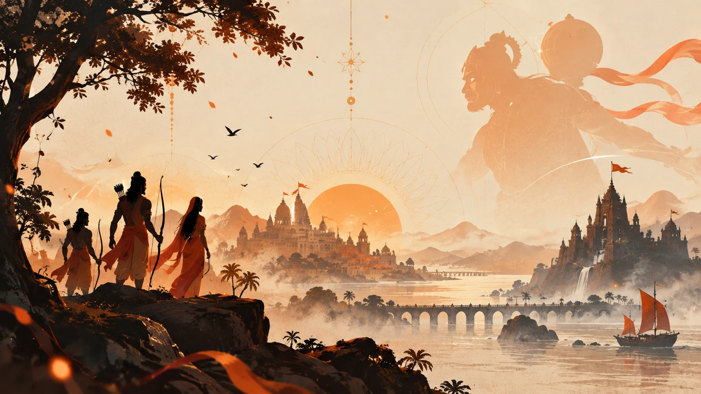
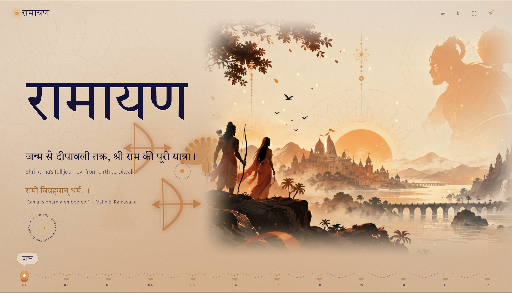
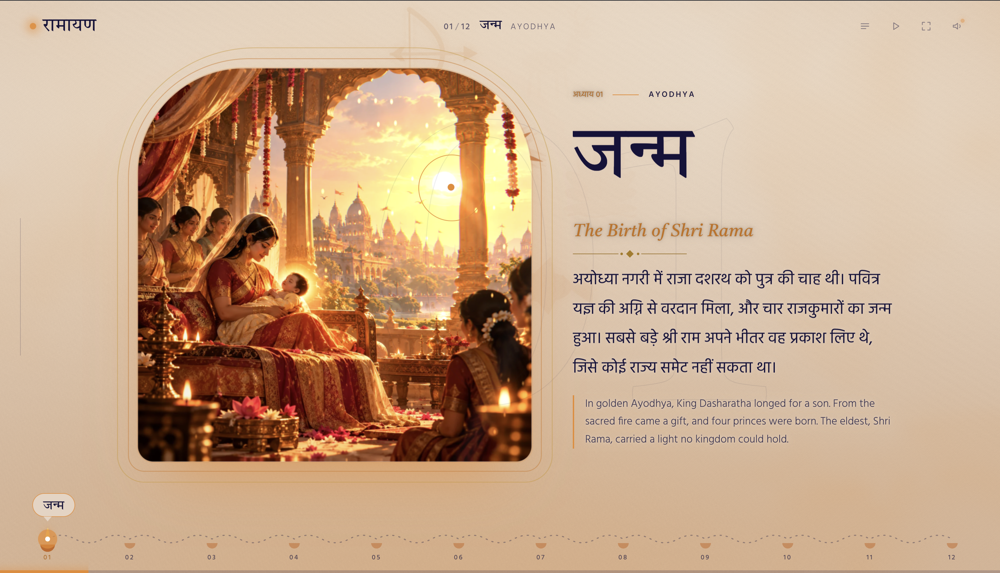
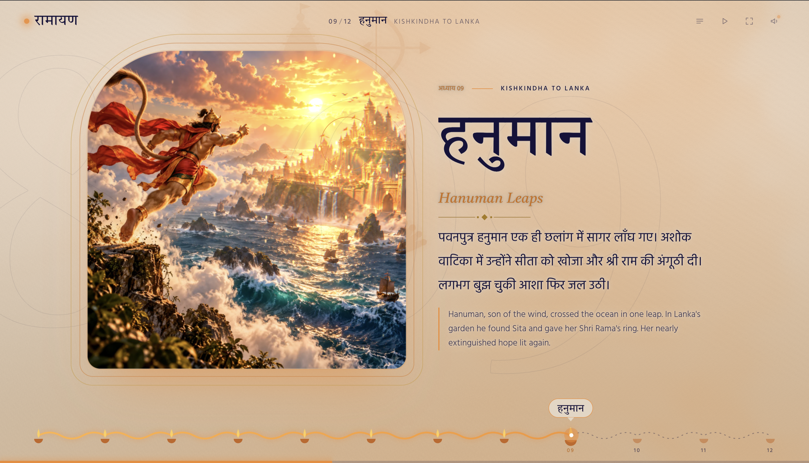
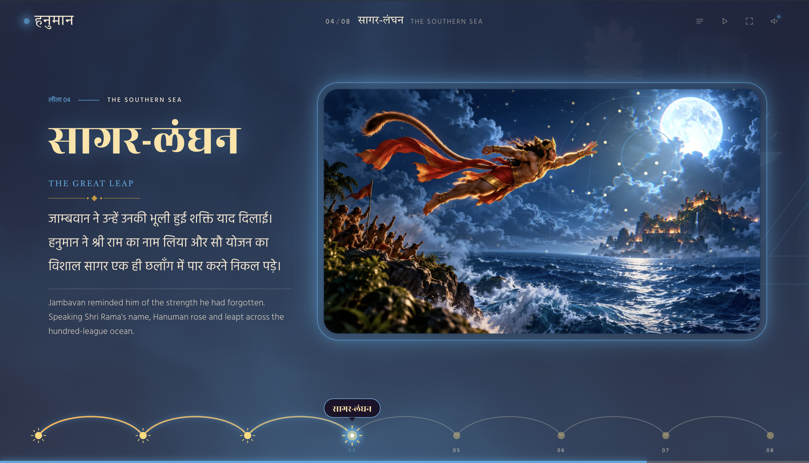
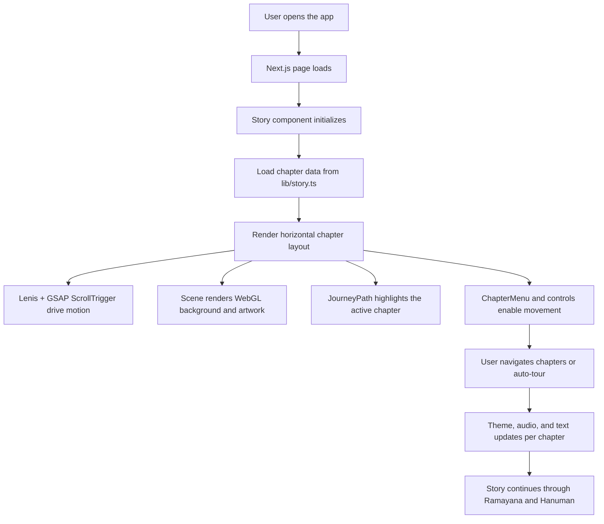

# Ramayana Experience

A cinematic, horizontally scrolling digital retelling of the Ramayana and Hanuman's story, built with Next.js, React, GSAP, Lenis, and Three.js. The experience blends rich photography, layered motion, ambient audio, and immersive chapter transitions into a story-driven web experience inspired by Indian temple art, sacred landscapes, and devotional storytelling.



<div align="center">
  
  
</div>

<div align="center">
  
  
</div>

## Overview

This project reimagines the Epic Ramayana as an interactive, immersive digital journey. It tells the story in chapters, using a long horizontal scroll rather than a traditional page layout. Visitors move through sacred moments, from King Dasharatha's longing for a son to Rama's exile, the search for Sita, the bridge to Lanka, and the continuing story of Hanuman's devotion.

The experience is designed to feel like a modern digital mural: atmospheric paper-like backgrounds, luminous chapter transitions, soft motion, layered storytelling, and responsive soundscapes.

## Why this project matters

- It turns a sacred narrative into an immersive web experience.
- It combines visual storytelling with motion design and audio atmosphere.
- It preserves the emotional arc of the Ramayana while using modern front-end technology.
- It creates a smooth, cinematic reading experience on desktop and mobile-sized displays.

## Key features

- Horizontal storytelling experience with smooth scroll-driven transitions
- Two major story arcs: Ramayana and Hanuman's leela
- Animated chapter menu and chapter-to-chapter navigation
- Auto-tour mode for presentation or demo usage
- Fullscreen mode and responsive layout adjustments
- Dynamic theme changes between paper-toned and night-toned scenes
- Procedural and layered visual treatment using WebGL and shader-driven background effects
- Cinematic photo-based artwork with chapter-specific color palettes
- Ambient sound controls and selectable tracks
- WebGL fallback behavior for unsupported environments
- Reduced-motion-friendly adjustments for accessibility

## High-level project flow



## Story flow

```mermaid
flowchart LR
    A[Birth of Rama] --> B[Sage's call]
    B --> C[Marriage of Sita]
    C --> D[Exile]
    D --> E[Bharata's sandals]
    E --> F[Golden deer]
    F --> G[Jatayu and Shabari]
    G --> H[Friends in Kishkindha]
    H --> I[Hanuman's leap]
    I --> J[Bridge to Lanka]
    J --> K[Victory and return]
    K --> L[Hanuman story begins]
    L --> M[Son of the wind]
    M --> N[Sun fruit and first meeting]
    N --> O[Crossing the ocean]
    O --> P[Gift of hope in Ashoka Vatika]
    P --> Q[Lanka burns]
    Q --> R[Mountain of herbs]
    R --> S[Devotion in the heart]
```



## Architecture and component structure

The app is organized around a single immersive storytelling page with several visual and motion subsystems.

```text
ramayana/
├── app/
│   ├── globals.css         # Global styling, theme variables, layout rules
│   ├── layout.tsx          # App metadata, fonts, root layout
│   └── page.tsx            # Root page entry
├── components/
│   ├── Story.tsx           # Main composition and app flow
│   ├── Scene.tsx           # Visual scene / WebGL / reveal system
│   ├── JourneyPath.tsx     # Path, milestones, and chapter progress
│   ├── ChapterMenu.tsx     # Chapter navigation menu
│   ├── SoundMenu.tsx       # Audio selection and toggles
│   ├── Sun.tsx             # Sun artwork for transition moments
│   ├── Mandala.tsx         # Decorative mandala and ornament elements
│   └── ...
├── lib/
│   ├── story.ts            # Chapter data and story metadata
│   ├── audio.ts            # Soundtrack configuration and playback logic
│   └── ...
├── public/
│   ├── img/                # Photo chapter artwork and hero images
│   ├── img/t/              # Thumbnail assets
│   ├── art/                # SVG motifs and decorative art
│   ├── audio/              # Sound track files
│   └── ...
├── scripts/
│   └── ...                 # Asset generation helpers
├── package.json
├── next.config.mjs
├── tsconfig.json
├── README.md
└── ...
```

## Story content model

The chapter content is defined in `lib/story.ts`. Each chapter contains metadata such as:

- chapter id
- Hindi and English titles
- location
- palette
- artwork path
- aspect ratio
- narrative copy
- accent color and mood data

This makes it easy to add, edit, or replace chapters without changing the layout system.

## Technology stack

- Next.js 16
- React 19
- TypeScript
- Three.js
- GSAP
- Lenis
- Custom CSS and advanced visual styling
- Photographic and SVG image assets

## Running the project locally

1. Install dependencies:

```bash
npm install
```

2. Start the development server:

```bash
npm run dev
```

3. Open the app in your browser:

```text
http://localhost:3000
```

## Production build

```bash
npm run build
npm run start
```

## Controls and interaction

- Scroll or swipe to move through the story horizontally
- Use chapter menu for direct navigation
- Press `M` to open the chapter menu
- Press `P` to enable auto-tour
- Press `F` to toggle fullscreen
- Press `S` to open the sound menu
- The app includes a no-WebGL fallback path and reduced-motion-aware behavior

## Audio and ambience

The app uses layered ambient sound cues to deepen the storytelling experience. The sound system supports different track modes and smooth transitions between them. Audio settings are configured in `lib/audio.ts`, while assets live under `public/audio/`.

This creates a calmer, devotional audio atmosphere that matches the visual tone of the narrative.

## Customization points

### Add or edit chapters
Update the `chapters` array in `lib/story.ts`.

### Replace artwork
Add or update image files in `public/img/` and `public/img/t/`.

### Update sound
Edit track names and configuration in `lib/audio.ts` and replace files in `public/audio/`.

### Change motion style
Adjust timing, scroll behavior, and effects in `components/Story.tsx`, `components/Scene.tsx`, and the GSAP/Lenis configuration.

## Visual design direction

The design language of the project is inspired by:

- temple murals and manuscript illustration
- paper textures and warm devotional palettes
- sunrise, sunset, and nighttime transitions
- sacred geometry and mandala patterns
- cinematic still photography with soft motion overlays

## Future enhancement ideas

- Add multilingual narration or voice-over support
- Improve accessibility for screen readers and keyboard navigation
- Add chapter search or bookmarks
- Include a deeper interactive timeline of the narrative
- Provide downloadable wallpapers or poster mode

## Project summary

This project is more than a gallery or static landing page—it is an immersive digital storytelling experience that feels like stepping into a living Ramayana mural. It combines story, movement, image, and sound into a single connected journey, making the epic feel alive, visual, and deeply atmospheric.

## License

This project is currently maintained as a personal / portfolio-style experience. Add a license file if you plan to distribute or open-source it publicly.
